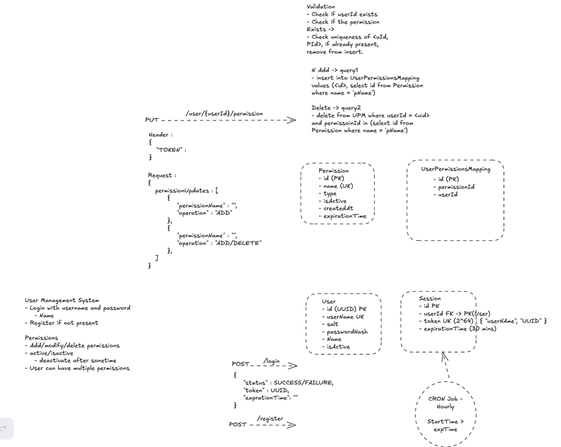

# 🏪 Walmart DSA Round – API Design & Data Modeling

---

## 📌 Problem Statement

Design a **User & Permission Management System** with the following capabilities:

### 🔹 Functional Requirements

1. **User Management**
    - Register a user
    - Login using username & password

2. **Session Management**
    - Generate a session token on login
    - Token should expire after a fixed duration

3. **Permission Management**
    - Add permission to a user
    - Delete permission from a user
    - A user can have multiple permissions

4. **Authorization**
    - All protected APIs must validate a session token

---

## 🖼️ System Design Reference



---

## 🧠 Step-by-Step Solution (Flow Driven)

---

### 🧩 Step 1: Identify Core Entities

We model the system using 4 key tables:

- `User`
- `Session`
- `Permission`
- `UserPermissionsMapping`

👉 Key Design Decision:
- Use **mapping table** for many-to-many relation between users and permissions

---

### 🧩 Step 2: Registration Flow

#### API

##### POST /register


#### Steps:
1. Validate input (username uniqueness)
2. Generate:
    - `userId (UUID)`
    - `salt`
3. Hash password using salt
4. Insert into DB

#### Key Constraint:
- `username` must be **unique**

---

### 🧩 Step 3: Login Flow

#### API

##### POST /login

#### Steps:
1. Fetch user by username
2. Validate password
3. Generate session token (UUID)
4. Store session with expiration time
5. Return token

#### Important Design Decisions:
- Token stored in DB (stateful session)
- Expiry handled at DB level

---

### 🧩 Step 4: Authentication (Token Validation)

Every protected API:

#### Steps:
1. Extract `TOKEN` from header
2. Validate:
    - Token exists
    - Not expired
3. Fetch `userId`

---

### 🧩 Step 5: Permission Update Flow

#### API

##### PUT /user/{userId}/permission


#### Request Structure
```json
{
  "permissionUpdates": [
    {
      "permissionName": "READ",
      "operation": "ADD"
    },
    {
      "permissionName": "WRITE",
      "operation": "DELETE"
    }
  ]
}
```

### 🧩 Step 6: Validation Layer (Critical for Interview)

Before executing any permission updates, perform strict validations:

#### ✅ Validations

1. **Token Validation**
    - Token must exist
    - Token must not be expired

2. **User Validation**
    - `userId` must exist
    - User must be active

3. **Permission Validation**
    - Permission should exist in `Permission` table
    - Permission should be active (if applicable)

4. **Duplicate Handling**
    - Avoid adding the same permission twice
    - Avoid redundant delete operations

5. **Idempotency**
    - Repeating the same request should not change system state

---

### 🧩 Step 7: Add Permission Flow

#### 🔄 Flow

1. Resolve `permissionId` using `permissionName`
2. Check if mapping already exists
3. Insert only if not present

#### 📌 Why This Matters

- Prevents duplicate entries
- Ensures idempotent behavior
- Avoids unnecessary DB writes

#### 🧾 Query

```sql
INSERT INTO UserPermissionsMapping (userId, permissionId)
SELECT :userId, p.id
FROM Permission p
WHERE p.name = :permissionName
AND NOT EXISTS (
    SELECT 1 FROM UserPermissionsMapping upm
    WHERE upm.userId = :userId
    AND upm.permissionId = p.id
);
```

## 📌 Additional Design Discussions

---

### 🧩 Step 8: Delete Permission Flow

#### 🔄 Flow

1. Resolve `permissionId` using `permissionName`
2. Delete mapping between user and permission

#### 📌 Key Properties

- Operation should be **idempotent**
- If mapping does not exist → **no-op (safe delete)**
- Should not throw error for repeated deletes

#### 🧾 Query

```sql
DELETE FROM UserPermissionsMapping
WHERE userId = :userId
AND permissionId IN (
    SELECT id FROM Permission WHERE name = :permissionName
);
```

### 🧩 Step 9: Session Expiry Handling

#### ⏳ Problem

Sessions (tokens) should not remain valid indefinitely.  
We need a mechanism to:

- Expire inactive sessions
- Prevent unauthorized access using stale tokens
- Keep the Session table clean and efficient

---

#### 🔄 Flow

1. On login:
    - Generate token
    - Store `expirationTime` (e.g., current_time + 30 mins)

2. On every request:
    - Validate:
        - Token exists
        - `expirationTime > current_time`

3. Periodically:
    - Delete expired sessions

---

#### 🧾 Token Validation Query

```sql
SELECT userId
FROM Session
WHERE token = :token
AND expirationTime > CURRENT_TIMESTAMP;
```

## ⚙️ Important Design Considerations

---

### 1. Idempotency

Ensure APIs behave safely on retries:

- **ADD Permission**
    - Should not create duplicate entries
    - Use `NOT EXISTS` or DB constraint

- **DELETE Permission**
    - Should not fail if mapping does not exist
    - Treat as **no-op**

Why important?
- Retries are common in distributed systems
- Prevents inconsistent state

---

### 2. Data Integrity

Enforce correctness at the **database level**:

#### 🔒 Constraints

- `User.userName` → UNIQUE
- `Permission.name` → UNIQUE
- `UserPermissionsMapping(userId, permissionId)` → COMPOSITE UNIQUE

```sql
UNIQUE (userId, permissionId)
```

## 📌 Indexing Strategy

Proper indexing is **critical for performance**, especially for authentication, authorization, and cleanup operations.

---

### 🗂️ Recommended Indexes

| Table                     | Column(s)                     | Index Type        | Purpose                          |
|--------------------------|------------------------------|-------------------|----------------------------------|
| **Session**              | `token`                      | UNIQUE INDEX      | Fast authentication lookup       |
|                          | `expirationTime`             | INDEX             | Efficient cleanup of sessions    |
| **User**                 | `userName`                   | UNIQUE INDEX      | Fast login lookup                |
| **Permission**           | `name`                       | UNIQUE INDEX      | Quick permission resolution      |
| **UserPermissionsMapping** | `userId`                    | INDEX             | Fetch permissions for a user     |
|                          | `permissionId`               | INDEX             | Reverse lookup (users by perm)   |
|                          | `(userId, permissionId)`     | UNIQUE INDEX      | Prevent duplicate mappings       |

---

### 📈 Impact of Indexing

| Operation              | Without Index               | With Index                  | Impact                         |
|-----------------------|----------------------------|-----------------------------|--------------------------------|
| Token Validation      | Full table scan            | Index lookup (O(log N))     | Faster authentication          |
| User Login            | Full scan on `User` table  | Indexed lookup              | Reduced latency                |
| Permission Lookup     | Slow joins/subqueries      | Indexed joins               | Faster authorization           |
| Add Permission        | Risk of duplicates         | Unique constraint enforced  | Data integrity + correctness   |
| Delete Permission     | Scan mapping table         | Indexed delete              | Faster updates                 |
| Session Cleanup       | Scan entire table          | Indexed on expiry           | Efficient batch deletion       |

---